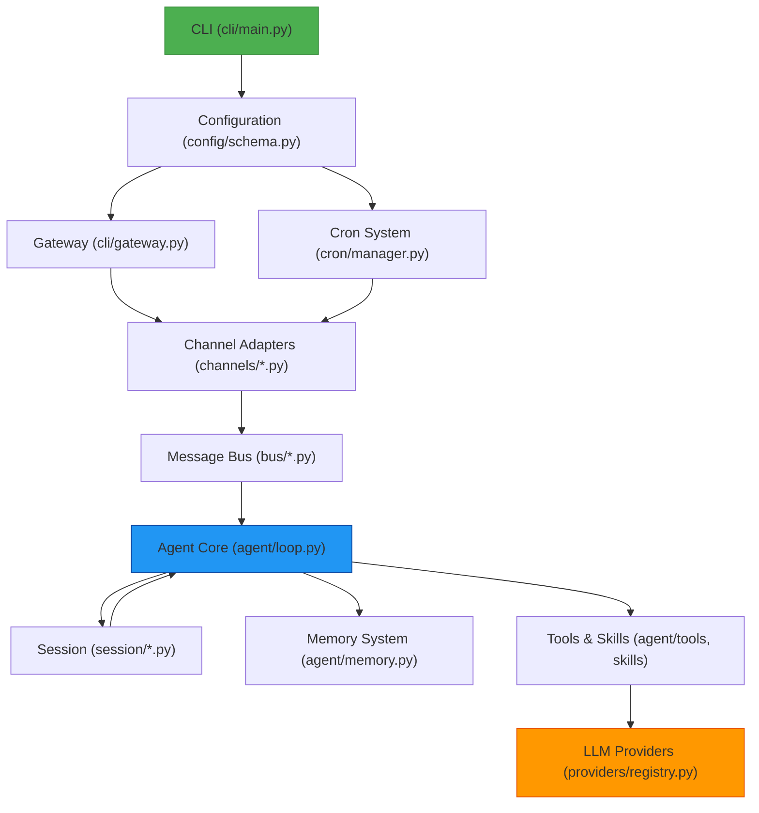
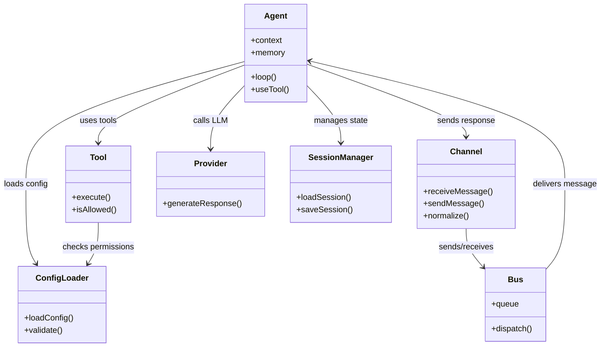
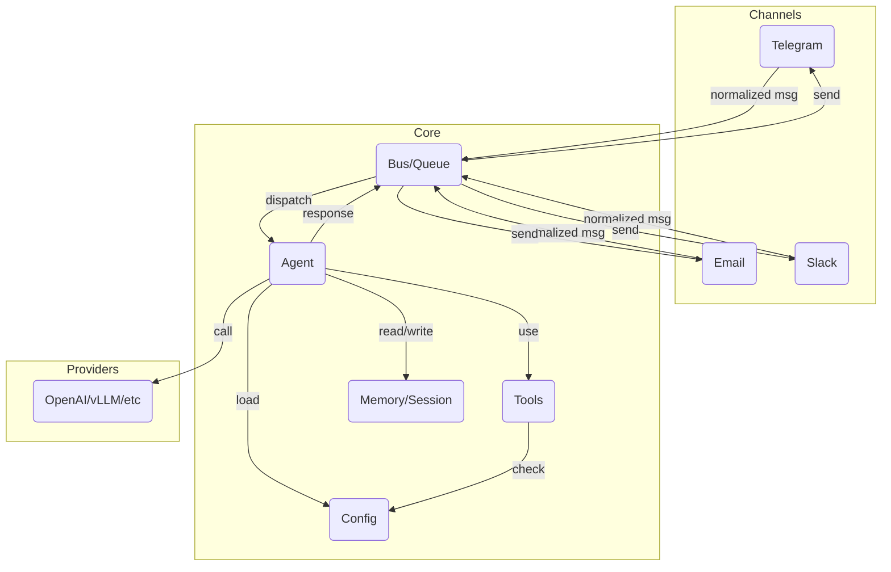
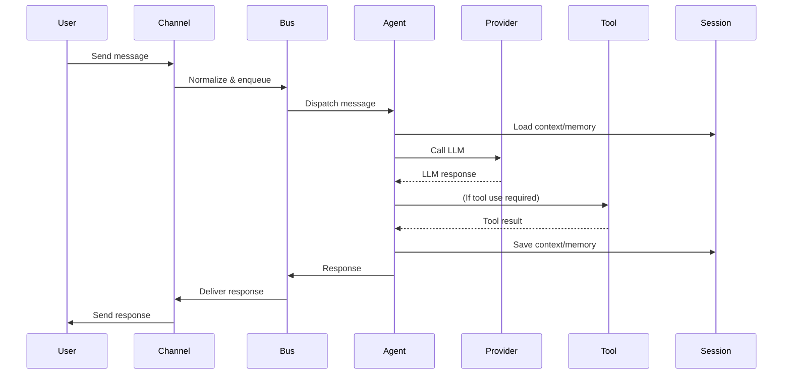

## Nanobot Architecture Diagram (Component/Data Flow)

This diagram provides a high-level overview of the main components and their interactions in the nanobot system, including CLI entry, configuration, gateway, cron, channels, bus, agent core, session, memory, tools/skills, and LLM providers.


# Nanobot Architecture Overview

## Dive Deeper: Detailed Module Documentation


For a deeper understanding of each building block in the nanobot system, see the following documents:

- [Agent Module](AGENT_MODULE.md): Core orchestration, context, memory, and tool use
- [Channels Module](CHANNELS_MODULE.md): Message normalization and routing
- [Providers Module](PROVIDERS_MODULE.md): LLM provider abstraction and extension
- [Bus Module](BUS_MODULE.md): Event/message queueing system
- [Tools Module](TOOLS_MODULE.md): Secure, extensible tool execution
- [Skills & Cron Module](SKILLS_CRON_MODULE.md): Skills and scheduled task integration
- [Config & Session Module](CONFIG_SESSION_MODULE.md): Configuration and session/user state management
- [CLI & Utils Modules](CLI_UTILS_MODULES.md): Command-line interface and helper utilities
- [WhatsApp Bridge Integration](WHATSAPP_BRIDGE_INTEGRATION.md): Node.js bridge for WhatsApp and Python backend integration
- [Supporting Services: Heartbeat & Cron](SUPPORTING_SERVICES_HEARTBEAT_CRON.md): Background automation and scheduling services

This document provides a practical, code-based breakdown of the nanobot architecture, focusing on clarity and extensibility for developers aiming to build a similar lightweight AI agent system.


## 1. Core Architecture


# UML Diagrams for Nanobot Architecture


Below are UML diagrams to visually explain the architecture and flow of the nanobot system.

## Class Diagram

This diagram shows the main classes/components and their relationships:



## Component Diagram

This diagram shows the high-level components and their interactions:



## Sequence Diagram

This diagram traces the path of a user message from input to response:



---

These diagrams provide a visual summary of the nanobot system's modular, extensible, and secure architecture.


### Main Modules/Directories & Responsibilities

- **agent/**  
  Core agent logic: context, memory, execution loop, skills, subagent, and tool definitions.
  - Example:
    - `nanobot/agent/loop.py`: Main agent execution loop.
    - `nanobot/agent/tools/`: Tool definitions (shell, filesystem, web, etc.).

- **channels/**  
  Integrations for different communication platforms (Telegram, Email, Slack, etc.).
  - Each file (e.g., `nanobot/channels/telegram.py`) implements message normalization and platform-specific logic.

- **providers/**  
  Abstraction for LLM providers (OpenAI, vLLM, etc.).
  - `nanobot/providers/base.py`: Provider interface.
  - `nanobot/providers/litellm_provider.py`: Example provider implementation.

- **bus/**  
  Event and message queueing between components.
  - `nanobot/bus/events.py`: Event definitions.
  - `nanobot/bus/queue.py`: Message queue logic.

- **skills/**  
  Pluggable skills (features) and scheduled tasks.
  - Each skill is a subdirectory with a SKILL.md and code.

- **config/**  
  Configuration loading and schema validation.
  - `nanobot/config/loader.py`: Loads config files.
  - `nanobot/config/schema.py`: Defines config schema.

- **session/**  
  Session and user state management.
  - `nanobot/session/manager.py`: Handles session state.


- **utils/**  
  Helper functions and utilities.

- **cli/**  
  Command-line interface (CLI) entry point and command definitions.  
  - `nanobot/cli/commands.py`: Defines the Typer-based CLI app and all user commands (onboarding, config, run, etc.).
  - `nanobot/__main__.py`: Module entry point (`python -m nanobot`) that launches the CLI app.
  - Keeps CLI logic modular and separate from agent runtime.

---

### Supporting Services: Heartbeat & Cron

- **heartbeat/**  
  Provides periodic agent wake-ups for background task checking.  
  - `nanobot/heartbeat/service.py`: `HeartbeatService` triggers agent actions based on workspace instructions (HEARTBEAT.md).
- **cron/**  
  Schedules and manages recurring or one-off jobs for the agent.  
  - `nanobot/cron/service.py`: `CronService` manages job definitions, timing, and execution.

**Both services act as automation triggers, feeding tasks into the agent or bus, but are not part of the main message flow.**

---

### Data Flow Diagram (Text-Based)

```
[User Input (Telegram/Email/etc.)]
        |
        v
[channels/<platform>.py] --(normalize)--> [bus/queue.py]
        |
        v
[agent/loop.py] --(context, memory)--> [providers/<llm>.py]
        |
        v
[agent/tools/<tool>.py] --(if tool use)-->
        |
        v
[agent/loop.py] --(response)--> [bus/queue.py]
        |
        v
[channels/<platform>.py] --(send)--> [User Output]
```

---

## 2. Agent Execution Loop

### Message Path: Input → LLM → Tool → Response

1. **Input**:  
   Message received by a channel (e.g., `nanobot/channels/telegram.py`).
   Normalized and passed to the bus.

2. **Queue/Bus**:  
   `nanobot/bus/queue.py` queues the message for processing.

3. **Agent Loop**:  
   `nanobot/agent/loop.py` picks up the message.
   Loads context and memory (`nanobot/agent/context.py`, `nanobot/agent/memory.py`).
   Calls LLM via provider (`nanobot/providers/`).

4. **Tool Use**:  
   If the LLM output triggers a tool, `nanobot/agent/tools/` executes it securely.

5. **Response**:  
   Agent loop generates a response, which is sent back through the bus and out via the originating channel.

### Memory/Session State

- Stored and loaded via `nanobot/agent/memory.py` and `nanobot/session/manager.py`.
- Uses in-memory or file-based storage for context and history.

### Tool Definition & Secure Execution

- Tools are defined in `nanobot/agent/tools/`, e.g., `shell.py`, `filesystem.py`.
- Security:  
  Tools check for workspace restrictions and user allowlists before executing commands (see code in `nanobot/agent/tools/base.py` and `filesystem.py`).

---

## 3. LLM Abstraction Layer

### Multi-Provider Support

- `nanobot/providers/base.py`: Defines a standard interface for LLM providers.
- `nanobot/providers/litellm_provider.py`: Implements the interface for LiteLLM.
- `nanobot/config/schema.py`: Config schema allows specifying provider and API keys.

**Adding a New Provider:**
1. Create a new file in `nanobot/providers/`, subclassing the base provider.
2. Implement required methods (e.g., `generate_response()`).
3. Add config options in `nanobot/config/schema.py`.

---

## 4. Multi-Channel Support

### Message Normalization & Routing

- Each channel (e.g., `nanobot/channels/telegram.py`, `nanobot/channels/email.py`) implements a class that:
  - Receives raw messages.
  - Normalizes them to a standard format.
  - Passes them to the bus/queue.

- The agent logic is channel-agnostic: all messages are routed through the same agent loop.

### Role of “bus” and “gateway”

- **bus/**: Handles event and message passing between channels and the agent.
- **gateway**: Not explicitly present, but the bus acts as the gateway for message routing.

---

## 5. Security & Sandboxing

### Restricting File/Tool Access

- Tools in `nanobot/agent/tools/` check for workspace mode and user permissions before executing.
- Example: `filesystem.py` restricts file access to allowed directories.

### API Keys & Allowlists

- API keys and user allowlists are handled in config files, loaded via `nanobot/config/loader.py` and validated in `nanobot/config/schema.py`.

---

## 6. Extensibility Patterns

### Skills & Scheduled Tasks

- Skills are modular, located in `nanobot/skills/`, each with its own SKILL.md and code.
- Scheduled tasks (cron) are implemented in `nanobot/agent/tools/cron.py` and `nanobot/cron/`.

### Modifying for Custom Use Cases

- Add new channels by creating a new file in `nanobot/channels/`.
- Add new tools by subclassing in `nanobot/agent/tools/`.
- Add new skills by creating a new directory in `nanobot/skills/`.

---

## Example: Adding a New LLM Provider

```python
# nanobot/providers/myprovider.py
from .base import LLMProviderBase

class MyProvider(LLMProviderBase):
    def generate_response(self, prompt, **kwargs):
        # Call your provider's API here
        return my_llm_api.generate(prompt, **kwargs)
```
Register in config/schema and loader.

---

## Example: Secure Tool Execution

```python
# nanobot/agent/tools/filesystem.py
def read_file(self, path):
    if not self.is_path_allowed(path):
        raise PermissionError("Access denied")
    # ...existing code...
```

---

## Summary Table

| Directory                | Responsibility                                 |
|--------------------------|------------------------------------------------|
| agent/                   | Core agent logic, tools, skills                |
| channels/                | Platform integrations (Telegram, Email, etc.)  |
| providers/               | LLM provider abstraction                       |
| bus/                     | Event/message queueing                         |
| config/                  | Config loading and schema                      |
| session/                 | Session/user state                             |
| skills/                  | Pluggable skills and scheduled tasks           |
| utils/                   | Helper functions                               |

---

**This modular, event-driven architecture makes it easy to add new channels, tools, skills, and LLM providers, while keeping security and extensibility in mind.**
You can use these patterns to build your own agent system and extend it for your clients’ needs.
