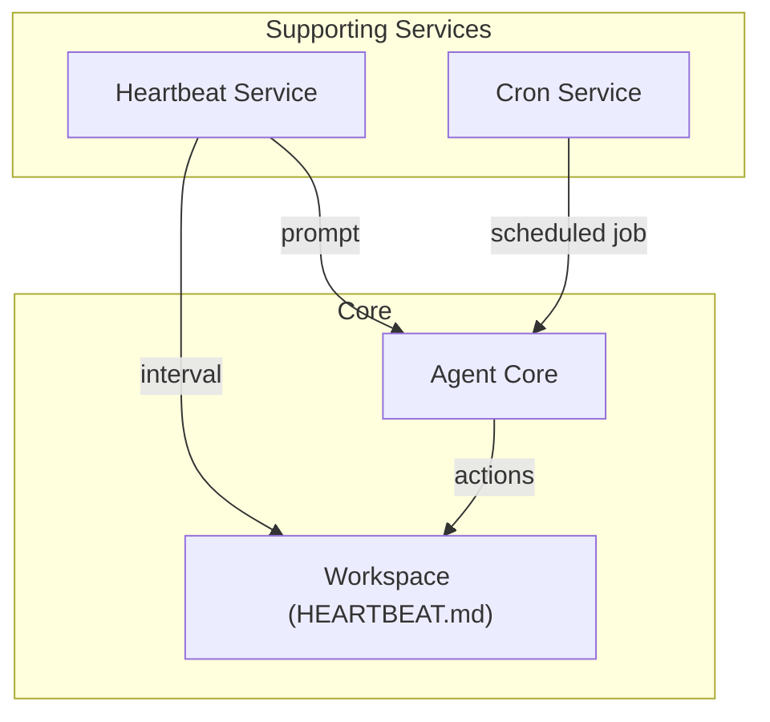
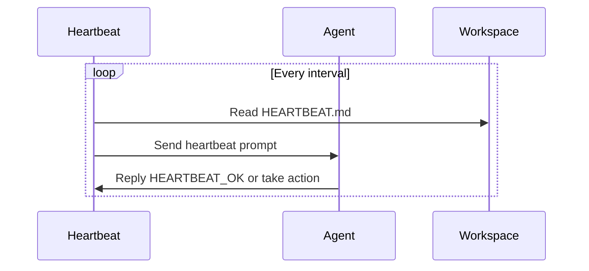
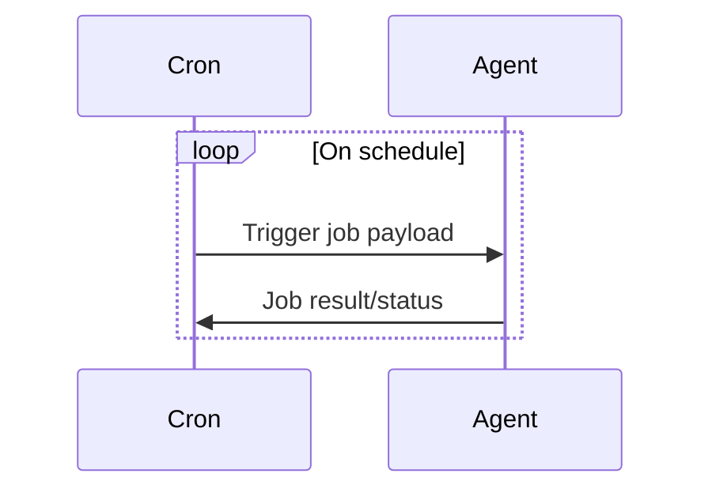

# Supporting Services: Heartbeat & Cron

This document provides a detailed explanation of the Heartbeat and Cron supporting services in the nanobot architecture, their code structure, responsibilities, and how they integrate with the rest of the system.

---

## Heartbeat Service

### Purpose
- Periodically wakes the agent to check for background tasks or instructions (e.g., from HEARTBEAT.md in the workspace).
- Ensures the agent can perform scheduled maintenance, reminders, or background actions even when no user message is received.

### Code Structure
- **nanobot/heartbeat/service.py**: Implements `HeartbeatService`.
- **nanobot/heartbeat/__init__.py**: Exports the service class.

### How It Works
1. On startup, `HeartbeatService` is initialized with the workspace path and a callback to the agent.
2. At a configurable interval (default: 30 minutes), it reads HEARTBEAT.md.
3. If actionable content is found, it triggers the agent with a special prompt.
4. The agent processes the prompt and acts on any instructions.
5. If nothing is needed, the agent replies with `HEARTBEAT_OK`.

### Integration
- **Agent Core**: Receives heartbeat prompts as if they were user messages.
- **Workspace**: Uses HEARTBEAT.md as the source of scheduled instructions.
- **Config**: Interval and enable/disable can be set in config.

---

## Cron Service

### Purpose
- Schedules and manages recurring or one-off jobs for the agent (e.g., reminders, periodic tasks, scheduled messages).
- Enables advanced automation and time-based workflows.

### Code Structure
- **nanobot/cron/service.py**: Implements `CronService` for job management and execution.
- **nanobot/cron/types.py**: Defines job, schedule, and payload types.
- **nanobot/cron/__init__.py**: Exports the service and types.

### How It Works
1. On startup, `CronService` loads job definitions from disk.
2. Each job has a schedule (at, every, or cron expression) and a payload (action/message).
3. The service computes the next run time for each job and triggers them as needed.
4. When a job is due, it invokes the agent (or a system event) with the specified payload.
5. Job state (last run, errors, etc.) is tracked and persisted.

### Integration
- **Agent Core**: Receives scheduled job payloads as if they were user messages or system events.
- **Config**: Jobs, schedules, and cron settings are managed via config and persisted storage.
- **Skills/Tools**: Cron jobs can trigger skills, send messages, or perform any agent action.

---

## Architecture Diagram

---

## Sequence Diagram: Heartbeat

---

## Sequence Diagram: Cron

---

## Summary
- **Heartbeat** and **Cron** are supporting/background services that automate agent actions without user input.
- They integrate with the agent core as message/event sources, enabling robust automation and scheduled workflows.
- Both are modular, configurable, and can be extended for advanced use cases.
