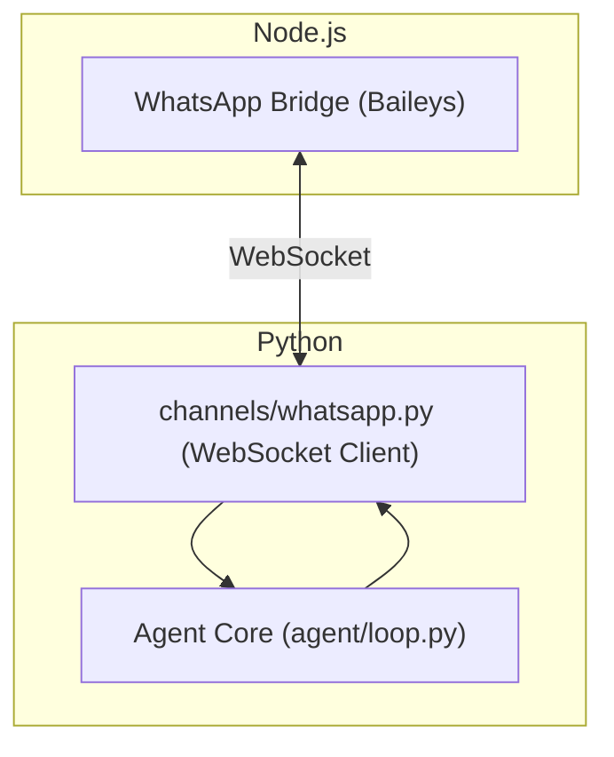
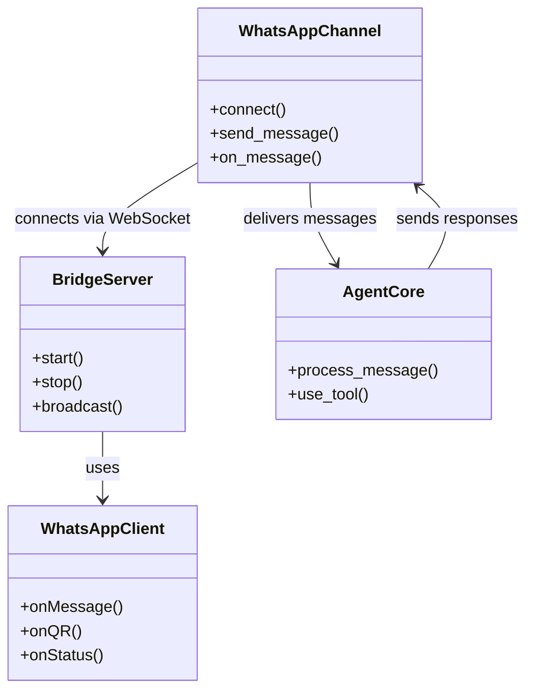
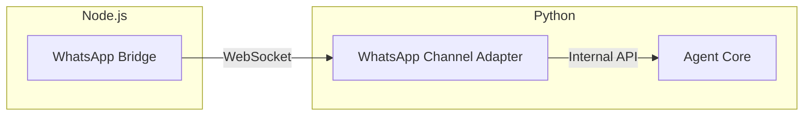
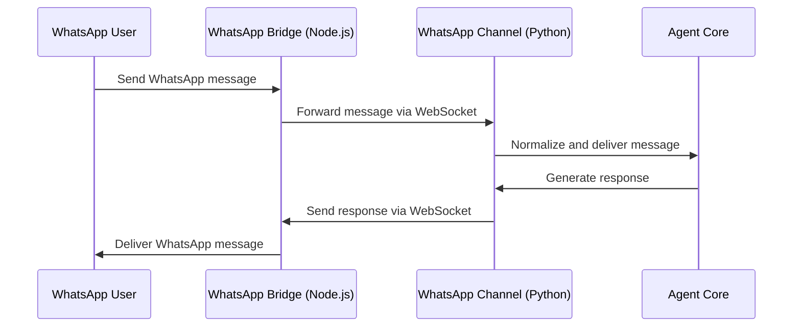

# WhatsApp Bridge Integration with Nanobot Python Backend

This document explains how the Node.js-based WhatsApp bridge integrates with the Python nanobot agent core (agentcore) over WebSocket, including code structure, data flow, and architecture diagrams.

---

## Overview

The WhatsApp bridge is a standalone Node.js service that connects to WhatsApp Web using the Baileys library. It exposes a local WebSocket server, allowing the Python nanobot backend to send and receive WhatsApp messages without handling WhatsApp protocol details directly.

- **Bridge runs as a separate process** (Node.js)
- **Python backend connects via WebSocket** (localhost, default port 3001)
- **All WhatsApp events and messages are relayed over this channel**

---

## Code Structure

### Node.js Bridge (bridge/)
- **src/index.ts**: Entry point, starts the WebSocket server and WhatsApp client.
- **src/server.ts**: Implements the WebSocket server, relays messages between WhatsApp and Python backend.
- **src/whatsapp.ts**: Handles WhatsApp connection, QR login, message events, and reconnection logic.

### Python Backend (agentcore)
- **channels/whatsapp.py** (or similar): Implements a WebSocket client that connects to the bridge, normalizes WhatsApp messages, and routes them into the agent core.
- **agent/loop.py**: Processes WhatsApp messages like any other channel.

---

## Architecture Diagram

---

## Class Diagram (Simplified)

---

## Component Diagram

---

## Sequence Diagram

---

## Detailed Flow

1. **Bridge Startup**: Node.js bridge starts, connects to WhatsApp Web, and opens a WebSocket server on localhost.
2. **Python Channel Connects**: Python backend (channels/whatsapp.py) connects to the bridge via WebSocket.
3. **Message Inbound**: When a WhatsApp message arrives, the bridge forwards it over WebSocket to the Python backend.
4. **Agent Processing**: The Python channel adapter normalizes the message and routes it to the agent core for processing.
5. **Response Outbound**: The agent core generates a response, which is sent back through the channel adapter to the bridge, and then out to WhatsApp.

---

## Security & Extensibility
- The bridge binds to 127.0.0.1 only and can require a token for authentication.
- The architecture allows for additional bridges (e.g., for other platforms) using the same pattern.
- Keeps WhatsApp logic isolated from the Python codebase, improving maintainability and security.

---

**This modular, language-agnostic bridge pattern enables robust WhatsApp integration for nanobot, while keeping the core agent system clean and extensible.**
